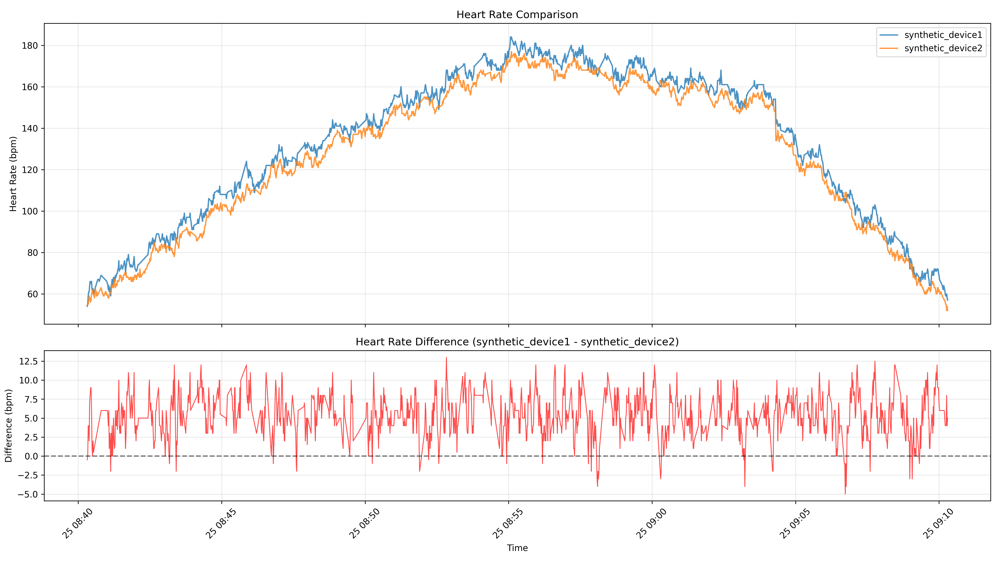

```
Using TCX files: [PosixPath('synthetic_device1.tcx'), PosixPath('synthetic_device2.tcx')]
Loading TCX files...
synthetic_device1: 1444 heart rate records
synthetic_device2: 1646 heart rate records

==================================================
SUMMARY STATISTICS
==================================================

synthetic_device1:
  Min HR: 54.0 bpm
  Avg HR: 132.9 bpm
  Max HR: 184.0 bpm
  Records: 1444

synthetic_device2:
  Min HR: 52.0 bpm
  Avg HR: 126.9 bpm
  Max HR: 177.0 bpm
  Records: 1646

Difference (synthetic_device1 - synthetic_device2):
  Min Difference: -5.0 bpm
  Avg Difference: 5.4 bpm
  Max Difference: 13.0 bpm
  Avg Absolute Difference: 5.5 bpm
  Matching timestamps: 1321
```